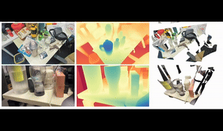
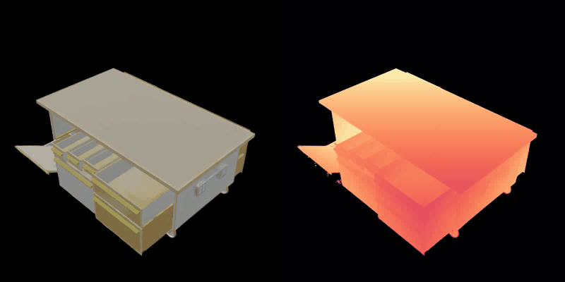
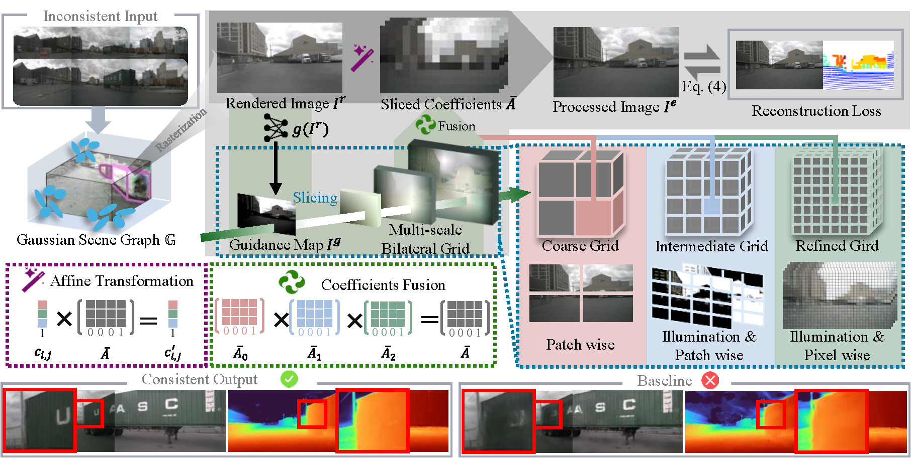
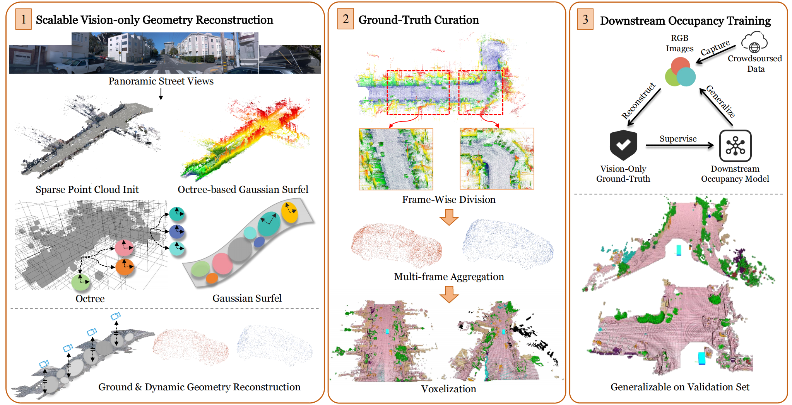

I'm Saining Zhang, a Ph.D. student in the College of Computing and Data Science at [Nanyang Technological University](https://www.ntu.edu.sg/computing), supervised by Prof. [Hanwang Zhang](https://mreallab.github.io/). I am currently working as a research intern on MLLM at [Huawei Singapore](https://www.huawei.com/sg/).
My research interest includes computer vision, computer graphics and embodied AI.

Previously, I received my bachelor’s degree from [Beijing Institute of Technology](https://cs.bit.edu.cn/) in 2024, where I was supervised by Prof. [Hao Zhao](https://sites.google.com/view/fromandto) from the Institute for AI Industry Research (AIR), [Tsinghua University](https://air.tsinghua.edu.cn/en/).

News
======
🎉 [11.2025] One paper got accepted to [3DV 2026](https://3dvconf.github.io/2026/)!  
🎉 [09.2025] One paper got accepted to [NeurIPS 2025](https://neurips.cc/)! Congrats to Nan!  
🎉 [06.2025] One paper got accepted to [ICCV 2025](https://iccv.thecvf.com/)! 
🎉 [06.2025] One paper got accepted to [IROS 2025](https://www.iros25.org/)! 
🎉 [04.2025] Our new technical report, [Selftok](https://selftok-team.github.io/report/), is now available. Congrats to all team members! 

Publications \[[Google Scholar](https://scholar.google.com/citations?user=P4efBMcAAAAJ&hl=zh-CN)\]
======
\* denotes equal contributions, † denotes corresponding author, ‡ denotes project lead. 

  
  

    <h3 style="margin: 0;"><a href="https://daniellli.github.io/projects/DKT/" style="text-decoration: none;">Diffusion Knows Transparency: Repurposing Video Diffusion for Transparent Object Depth and Normal Estimation</a></h3>
    

          Shaocong Xu, Songlin Wei, Qizhe Wei, Zheng Geng, Hong Li, Licheng Shen, Qianpu Sun, Shu Han, Bin Ma, Bohan Li, Chongjie Ye, Yuhang Zheng, Nan Wang, <strong>Saining Zhang</strong>, Hao Zhao†
           
          <a href="https://daniellli.github.io/projects/DKT/" style="text-decoration: none;">[Project page]</a>
          <a href="https://github.com/Daniellli/DKT" style="text-decoration: none;">[Code]</a>
    

    

      
    

  

  
  

    <h3 style="margin: 0;"><a href="https://lightx-ai.github.io/" style="text-decoration: none;">Light-X : Generative 4D Video Rendering with Camera and Illumination Control</a></h3>
    

          Tianqi Liu, Zhaoxi Chen, Zihao Huang, Shaocong Xu, <strong>Saining Zhang</strong>, Chongjie Ye, Bohan Li, Zhiguo Cao, Wei Li, Hao Zhao†, Ziwei Liu†
           
          <a href="https://lightx-ai.github.io/" style="text-decoration: none;">[Project page]</a>
          <a href="https://arxiv.org/pdf/2512.05115" style="text-decoration: none;">[Paper]</a>
          <a href="https://arxiv.org/abs/2512.05115" style="text-decoration: none;">[Arxiv]</a>
          <a href="https://github.com/TQTQliu/Light-X" style="text-decoration: none;">[Code]</a>
    

    

      
    

  

  
  

    <h3 style="margin: 0;"><a href="https://weichow23.github.io/weave/" style="text-decoration: none;">Unleashing and Benchmarking the Interleaved Cross-modality Comprehension and Generation</a></h3>
    

          Wei Chow*, Jiachun Pan*, Yongyuan Liang, Mingze Zhou, Liyu Jia, <strong>Saining Zhang</strong>, Xue Song, Siliang Tang, Juncheng Li, Fengda Zhang†, Weijia Wu†, Hanwang Zhang, Tat-Seng Chua
           
          <a href="https://weichow23.github.io/weave/" style="text-decoration: none;">[Project page]</a>
          <a href="https://arxiv.org/pdf/2511.11434" style="text-decoration: none;">[Paper]</a>
          <a href="https://arxiv.org/abs/2511.11434" style="text-decoration: none;">[Arxiv]</a>
          <a href="https://github.com/weichow23/weave" style="text-decoration: none;">[Code]</a>
    

    

      
    

  

  
  

    <h3 style="margin: 0;"><a href="https://sainingzhang.github.io/project/gaussianart/" style="text-decoration: none;">GaussianArt: Unified Modeling of Geometry and Motion for Articulated Objects</a></h3>
    

          Licheng Shen*, <strong>Saining Zhang*‡</strong>, Honghan Li*, Peilin Yang, Zihao Huang, Zongzheng Zhang, Hao Zhao†
           
          <b><i>3DV 2026</i></b> 
          <a href="https://sainingzhang.github.io/project/gaussianart/" style="text-decoration: none;">[Project page]</a>
          <a href="https://arxiv.org/pdf/2508.14891" style="text-decoration: none;">[Paper]</a>
          <a href="https://arxiv.org/abs/2508.14891" style="text-decoration: none;">[Arxiv]</a>
          <a href="https://github.com/shenlc19/GaussianArt" style="text-decoration: none;">[Code]</a>
    

    

      
    

  

  
  

    <h3 style="margin: 0;"><a href="https://bigcileng.github.io/bilateral-driving/" style="text-decoration: none;">Unifying Appearance Codes and Bilateral Grids for Driving Scene Gaussian Splatting</a></h3>
    

          Nan Wang, Yuantao Chen, Lixing Xiao, Weiqing Xiao, Bohan Li, Zhaoxi Chen, Chongjie Ye, Shaocong Xu, <strong>Saining Zhang</strong>, Ziyang Yan, Pierre Merriaux, Lei Lei, Tianfan Xue, Hao Zhao†
           
          <b><i>NeurIPS 2025</i></b> 
          <a href="https://bigcileng.github.io/bilateral-driving/" style="text-decoration: none;">[Project page]</a>
          <a href="https://arxiv.org/pdf/2506.05280" style="text-decoration: none;">[Paper]</a>
          <a href="https://arxiv.org/abs/2506.05280" style="text-decoration: none;">[Arxiv]</a>
          <a href="https://github.com/BigCiLeng/bilateral-driving" style="text-decoration: none;">[Code]</a>
    

    

      
    

  

  
  

    <h3 style="margin: 0;"><a href="https://gs-occ3d.github.io/" style="text-decoration: none;">GS-Occ3D: Scaling Vision-only Occupancy Reconstruction with Gaussian Splatting</a></h3>
    

          <strong>Saining Zhang*</strong>, Baijun Ye*, Minghui Qin*, Moonjun Gong, Shaoting Zhu, Zebang Shen, Luan Zhang, Lu Zhang, Hao Zhao, Hang Zhao†
           
          <b><i>ICCV 2025</i></b> 
          <a href="https://gs-occ3d.github.io/" style="text-decoration: none;">[Project page]</a>
          <a href="https://arxiv.org/pdf/2507.19451" style="text-decoration: none;">[Paper]</a>
          <a href="https://arxiv.org/abs/2507.19451" style="text-decoration: none;">[Arxiv]</a>
    

    

      
    

  

  
  

    <h3 style="margin: 0;"><a href="https://github.com/SainingZhang/CRUISE?tab=readme-ov-file#cruise-cooperative-reconstruction-and-editing-in-v2x-scenarios-using-gaussian-splatting" style="text-decoration: none;">CRUISE: Cooperative Reconstruction and Editing in V2X Scenarios using Gaussian Splatting</a></h3>
    

          Haoran Xu*, <strong>Saining Zhang*‡</strong>, Peishuo Li*, Baijun Ye, Xiaoxue Chen, Huan-ang Gao, Jv Zheng, Xiaowei Song, Ziqiao Peng, Run Miao, Jinrang Jia, Yifeng Shi, Guangqi Yi, Hang Zhao, Hao Tang, Hongyang Li, Kaicheng Yu, Hao Zhao† 
           
          <b><i>IROS 2025, Oral</i></b> 
          <a href="https://arxiv.org/pdf/2507.18473" style="text-decoration: none;">[Paper]</a>
          <a href="https://arxiv.org/abs/2507.18473" style="text-decoration: none;">[Arxiv]</a>
          <a href="https://github.com/SainingZhang/CRUISE?tab=readme-ov-file#cruise-cooperative-reconstruction-and-editing-in-v2x-scenarios-using-gaussian-splatting" style="text-decoration: none;">[Code]</a>
    

    

      
    

  

  
  

    <h3 style="margin: 0;"><a href="https://selftok-team.github.io/report/" style="text-decoration: none;">Selftok: Discrete Visual Tokens of Autoregression, by Diffusion, and for Reasoning</a></h3>
    

          <strong>Selftok Team</strong> (Saining Zhang: Core contributor)
           
          <b><i>Technical report</i></b>, an extended version of <a href="https://ddt-llama.github.io/">DDT-LLaMA</a>  
          <a href="https://selftok-team.github.io/report/" style="text-decoration: none;">[Project page]</a>
          <a href="https://arxiv.org/pdf/2505.07538" style="text-decoration: none;">[Paper]</a>
          <a href="https://arxiv.org/abs/2505.07538" style="text-decoration: none;">[Arxiv]</a>
          <a href="https://github.com/selftok-team/SelftokTokenizer" style="text-decoration: none;">[Code]</a>
    

    

      
    

  

  
  

    <h3 style="margin: 0;"><a href="https://zhuxing0.github.io/projects/SA-Radar/" style="text-decoration: none;">Simulate Any Radar: Attribute-Controllable Radar Simulation via Waveform Parameter Embedding</a></h3>
    

          Weiqing Xiao*, Hao Huang*, Chonghao Zhong*, Yujie Lin, Nan Wang, Xiaoxue Chen, Zhaoxi Chen, <strong>Saining Zhang</strong>, Shuocheng Yang, Pierre Merriaux, Lei Lei, Hao Zhao†
            
          <a href="https://zhuxing0.github.io/projects/SA-Radar/" style="text-decoration: none;">[Project page]</a>
          <a href="https://arxiv.org/pdf/2506.03134" style="text-decoration: none;">[Paper]</a>
          <a href="https://arxiv.org/abs/2506.03134" style="text-decoration: none;">[Arxiv]</a>
          <a href="https://github.com/zhuxing0/SA-Radar" style="text-decoration: none;">[Code]</a>
    

    

      
    

  

  
  

    <h3 style="margin: 0;"><a href="https://sainingzhang.github.io/project/uc-gs/" style="text-decoration: none;">Drone-assisted Road Gaussian Splatting with Cross-view Uncertainty</a></h3>
    

          <strong>Saining Zhang*</strong>, Baijun Ye*, Xiaoxue Chen, Yuantao Chen, Zongzheng Zhang, Cheng Peng, Yongliang Shi, Hao Zhao†
           
          <b><i>BMVC 2024</i></b> 
          <a href="https://sainingzhang.github.io/project/uc-gs/" style="text-decoration: none;">[Project page]</a>
          <a href="https://arxiv.org/pdf/2408.15242" style="text-decoration: none;">[Paper]</a>
          <a href="https://arxiv.org/abs/2408.15242" style="text-decoration: none;">[Arxiv]</a>
          <a href="https://github.com/SainingZhang/uc-gs/" style="text-decoration: none;">[Code]</a>
    

    

      
    

  

  
  

    <h3 style="margin: 0;"><a href="https://github.com/SainingZhang/DDAMFN" style="text-decoration: none;">A Dual-Direction Attention Mixed Feature Network for Facial Expression Recognition</a></h3>
    

          <strong>Saining Zhang</strong>, Yuhang Zhang, Ye Zhang, Yufei Wang, Zhigang Song†
           
          <b><i>Electronics, 2023</i></b> 
          <a href="https://www.mdpi.com/2079-9292/12/17/3595" style="text-decoration: none;">[Paper]</a> 
          <a href="https://github.com/SainingZhang/DDAMFN" style="text-decoration: none;">[Code]</a>
    

    

      
    

  

Awards
======
* \[2024\] **Best Undergraduate Dissertation Award, Beijing Education Commission (top 0.9% in 130,000 students)**
* \[2024\] **Winner Award**, NTIRE 2024 (CVPR 2024 workshop) Stereo Image Super-Resolution
Challenge Track 1 & Track 2
* \[2021\] **Second place**, 2021 iFLYTEK A.I. Developer Competition Facial Expression Recognition
Challenge 

Internships
======
* 2024.09 - now, Singapore Graphics & Image Intelligence Lab, Huawei, Singapore.
* 2024.09 - 2025-05, D-Robotics, Horizon, China.
* 2022.06 - 2022.09, Vision Computing Lab, Samsung, China.

Service
======
I served / was delegated as Reviewer for NeurIPS 2025, IROS 2025, ACMMM 2024 and BMVC 2024.

