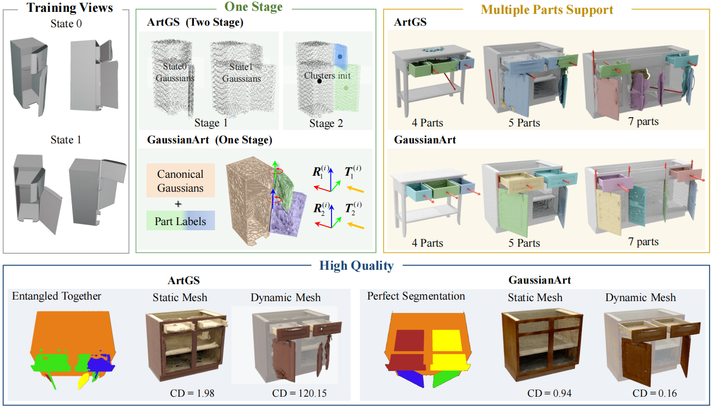
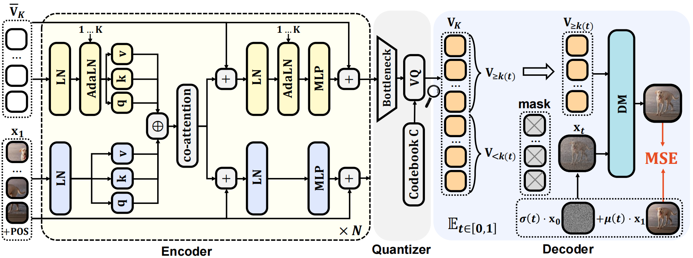
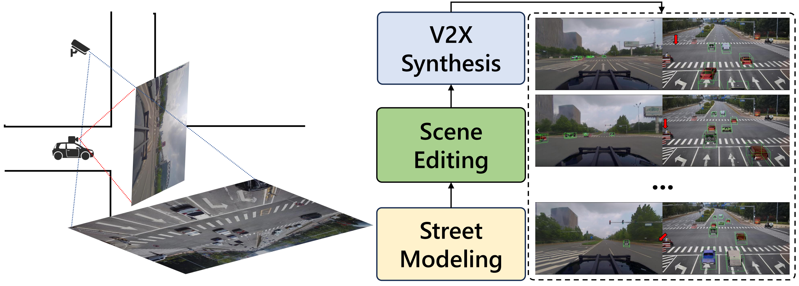
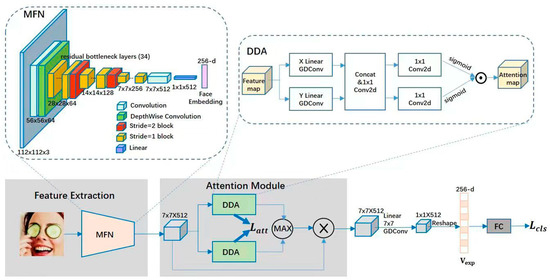

I'm a first year M.Eng. student from [College of Computing and Data Science](https://www.ntu.edu.sg/computing) (CCDS), Nanyang Technological University. I am currently working as a research intern on MLLM at [Huawei Singapore](https://www.huawei.com/sg/).
My research interest includes computer vision, computer graphics and embodied AI.

I am very fortunate to be advised by [Prof. Hanwang Zhang](https://personal.ntu.edu.sg/hanwangzhang/) of [MReaL](https://mreallab.github.io/) lab from CCDS, Nanyang Technological University. Previously, I received my B.S. degree at School of Computer Science & Technology, Beijing Institute of Technology. I've been working at Institute for AI Industry Research (AIR), Tsinghua University supervised by [Prof. Hao Zhao](https://sites.google.com/view/fromandto).

You can find my CV here: [Saining Zhang's Curriculum Vitae](../assets/CV.pdf).

News
======
🎉 [06.2025] One paper got accepted to [ICCV 2025](https://iccv.thecvf.com/)! 
🎉 [06.2025] One paper got accepted to [IROS 2025](https://www.iros25.org/)! 
🔥 [05.2025] The first work of the Art Group, [GaussianArt](https://sainingzhang.github.io/project/gaussianart/) will soon be available. Thanks to all team members for their hard work! 
🔥 [04.2025] Our new technical report, [Selftok](https://selftok-team.github.io/report/), is now available. Congrats to all team members! 
🔥 [03.2025] We have founded the Art Group, dedicated to interesting research in 2D and 3D. Our current members are from NTU and Tsinghua University. We look forward to having you join us!

Publications \[[Google Scholar](https://scholar.google.com/citations?user=P4efBMcAAAAJ&hl=zh-CN)\]
======
\* denotes equal contributions, † denotes corresponding author, ‡ denotes project lead. 

  
  

    <h3 style="margin: 0;"><a href="https://sainingzhang.github.io/project/gaussianart/" style="text-decoration: none;">GaussianArt: One-Stage Modeling of Articulated Objects with Scaled-Up Evaluation</a></h3>
    

          Licheng Shen*, <strong>Saining Zhang*‡</strong>, Honghan Li*, Zongzheng Zhang, Huan-ang Gao, Miao Run, Li Yi, Hao Zhao†
           
    

    

      
    

  

  
  

    <h3 style="margin: 0;"><a href="https://selftok-team.github.io/report/" style="text-decoration: none;">Selftok: Discrete Visual Tokens of Autoregression, by Diffusion, and for Reasoning</a></h3>
    

          <strong>Selftok Team</strong> (Saining Zhang: Core contributor)
           
          Technical report, an extended version of <a href="https://ddt-llama.github.io/">DDT-LLaMA</a>  
          <a href="https://selftok-team.github.io/report/" style="text-decoration: none;">[Project page]</a>
          <a href="https://arxiv.org/abs/2505.07538" style="text-decoration: none;">[Paper]</a> 
          <a href="https://github.com/selftok-team/SelftokTokenizer" style="text-decoration: none;">[Code]</a>
    

    

      
    

  

  
  

    <h3 style="margin: 0;"><a href="https://github.com/SainingZhang/CRUISE?tab=readme-ov-file#cruise-cooperative-reconstruction-and-editing-in-v2x-scenarios-using-gaussian-splatting" style="text-decoration: none;">CRUISE: Cooperative Reconstruction and Editing in V2X Scenarios using Gaussian Splatting</a></h3>
    

          Haoran Xu*, <strong>Saining Zhang*‡</strong>, Peishuo Li*, Baijun Ye, Xiaoxue Chen, Huan-ang Gao, Jv Zheng, Xiaowei Song, Ziqiao Peng, Run Miao, Jinrang Jia, Yifeng Shi, Guangqi Yi, Hang Zhao, Hao Tang, Hongyang Li, Kaicheng Yu, Hao Zhao† 
           
          IROS, 2025 
      Oral Presentation 
          <a href="https://github.com/SainingZhang/CRUISE?tab=readme-ov-file#cruise-cooperative-reconstruction-and-editing-in-v2x-scenarios-using-gaussian-splatting" style="text-decoration: none;">[Code]</a>
    

    

      
    

  

  
  

    <h3 style="margin: 0;"><a href="https://sainingzhang.github.io/project/uc-gs/" style="text-decoration: none;">Drone-assisted Road Gaussian Splatting with Cross-view Uncertainty</a></h3>
    

          <strong>Saining Zhang*</strong>, Baijun Ye*, Xiaoxue Chen, Yuantao Chen, Zongzheng Zhang, Cheng Peng, Yongliang Shi, Hao Zhao†
           
          BMVC, 2024   
          <a href="https://sainingzhang.github.io/project/uc-gs/" style="text-decoration: none;">[Project page]</a>
          <a href="https://arxiv.org/abs/2408.15242" style="text-decoration: none;">[Paper]</a> 
          <a href="https://github.com/SainingZhang/uc-gs/" style="text-decoration: none;">[Code]</a>
    

    

      
    

  

  
  

    <h3 style="margin: 0;"><a href="https://github.com/SainingZhang/DDAMFN" style="text-decoration: none;">A Dual-Direction Attention Mixed Feature Network for Facial Expression Recognition</a></h3>
    

          <strong>Saining Zhang</strong>, Yuhang Zhang, Ye Zhang, Yufei Wang, Zhigang Song†
           
          Electronics, 2023  
          <a href="https://www.mdpi.com/2079-9292/12/17/3595" style="text-decoration: none;">[Paper]</a> 
          <a href="https://github.com/SainingZhang/DDAMFN" style="text-decoration: none;">[Code]</a>
    

    

      
    

  

Awards
======
* \[2024\] **Best Undergraduate Dissertation Award, Beijing Education Commission (top 0.9% in 130,000 students)**
* \[2024\] **Winner Award**, NTIRE 2024 (CVPR 2024 workshop) Stereo Image Super-Resolution
Challenge Track 1 & Track 2
* \[2021\] **Second place**, 2021 iFLYTEK A.I. Developer Competition Facial Expression Recognition
Challenge 

Internships
======
* 2024.09 - now, Singapore Graphics & Image Intelligence Lab, Huawei, Singapore.
* 2024.09 - 2025-05, D-Robotics, Horizon, China.
* 2022.06 - 2022.09, Vision Computing Lab, Samsung, China.

Service
======
I served / was delegated as Reviewer for NeurIPS 2025, IROS 2025, ACMMM 2024 and BMVC 2024.

